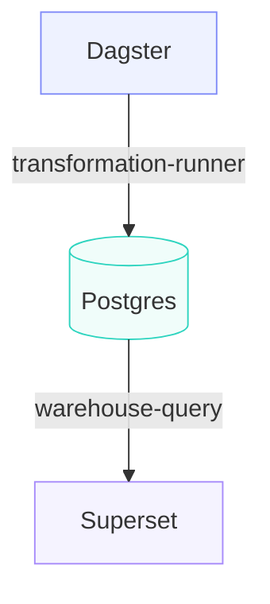

# 🚀 Composable Data Stack (CDS)

> **Terraform for data platforms.**  
> Build, validate, secure and evolve data stacks using modular components and explicit contracts.

---

## 🧠 What is CDS (in 1 minute)

Composable Data Stack (CDS) is a framework for defining and assembling data platforms from reusable modules such as orchestrators, warehouses, BI tools, and secrets providers.

Instead of hardcoding integrations or relying on fragile pipelines, CDS introduces:

- 🔧 **Modules** → reusable components (Dagster, Postgres, Superset)  
- 🔗 **Contracts** → explicit interfaces between components  
- 🧩 **Profiles** → fully composed, runnable stacks  

> Think: **Infrastructure-as-Code, but for data platforms**

✅ Swap tools without rewrites  
✅ Avoid hidden coupling  
✅ Build reproducible stacks  
✅ Catch security issues before deployment  

---

## ⚡ Why CDS?

Modern data platforms force a trade-off:

| Approach | Problem |
|----------|--------|
| Monolithic stack | Rigid, hard to evolve |
| Custom pipelines | Flexible but fragile and inconsistent |

👉 CDS gives you the best of both:

- composability **without chaos**
- flexibility **with guarantees**
- modularity **with structure**

---

## 🎯 When to use CDS

Use CDS if you:

- want to swap tools (Airflow ↔ Dagster, Superset ↔ Metabase)
- need reproducible environments across dev / CI / prod
- are building a platform for multiple teams
- want contract-driven integration instead of implicit coupling

CDS may be overkill if:

- you only run a single-tool stack
- you don't need interchangeable components

---

## 🏗️ Example

The `local-dagster-postgres-superset` profile defines:

- Dagster -> orchestration  
- Postgres -> storage  
- Superset -> BI  

### What CDS does:

1. Validates module definitions  
2. Resolves contract bindings  
3. Checks compatibility and security constraints  
4. Produces a fully wired stack definition  

`cds plan` resolves the full dependency graph before any runtime configuration is generated, ensuring that all module interactions are valid and predictable.

You can replace components without changing the system behavior:

```
Dagster -> Airflow
Superset -> Metabase
Postgres -> MariaDB
```

---

## 🗺️ Architecture Overview

CDS wires modules through **contracts**, not direct dependencies:



## 🔐 Security

CDS includes built-in security validation to prevent unsafe configurations
before a stack is deployed.

The `cds security` checks analyze profiles and modules for common risks such as:

- weak or default passwords
- missing secret configurations
- insecure service exposure
- unsafe defaults in module configuration
- incomplete contract bindings that may leak data

Security checks run as part of validation and can be extended with custom rules.
👉 CDS helps you catch security issues before runtime, not after deployment.

### Example

```bash
cds security local-dagster-postgres-superset
```

---

## 📦 What you get

When you run CDS:

- validated module graph  
- resolved contract bindings  
- dependency-aware execution plan  
- generated Docker Compose configuration  
- reproducible stack definition  

This allows you to go from a declarative profile to a runnable local data stack.

Coming next:

- Kubernetes generation  
- one-command stack bootstrap  
- automated health checks  

---

## 🚀 Quickstart

### 1. Clone

```bash
git clone https://github.com/RonaldHensbergen/composable-data-stack.git
cd composable-data-stack
```

### 2. Setup environment

```bash
python3 -m venv .venv
source .venv/bin/activate
pip install -e .
```

### 3. Configure environment

```bash
cp .env.example .env
```

Set:

```
CDS_POSTGRES_PASSWORD
CDS_SUPERSET_SECRET_KEY
CDS_SUPERSET_ADMIN_PASSWORD
```

### 4. Validate a stack

```bash
cds validate local-dagster-postgres-superset
```

Expected output:

```text
Profile is valid.
```

### 5. Run security checks

```bash
cds security local-dagster-postgres-superset
```

### 6. Generate a plan

```bash
cds plan local-dagster-postgres-superset
```

This resolves:

- module dependencies
- contract bindings
- execution order

### 7. Render the stack

```bash
cds render local-dagster-postgres-superset
```

This generates:

- docker-compose.yml
- service definitions
- fully wired module configuration

---

## 🧩 Core Concepts

### Modules

Reusable building blocks:

- orchestration (Dagster, Airflow)
- warehouse (Postgres, MariaDB)
- BI (Superset, Metabase)
- secrets (env, vault)

Structure:

```
modules/<category>/<name>/
├── module.yaml
├── defaults.yaml
├── compose.yaml
├── scripts/
└── tests/
```

---

### Contracts

Contracts define how modules interact.

Examples:

| Contract | Purpose |
|----------|--------|
| sql-database | database interface |
| http-service | service exposure |
| secrets-provider | secret resolution |

Example binding:

```yaml
dagster.database -> postgres.sql-database
superset.database -> postgres.sql-database
```

No implicit dependencies — everything is explicit.

---

### Profiles

Profiles define supported stacks:

```
local-dagster-postgres-superset
local-airflow-postgres-superset
integration-airflow-postgres-dbt
```

Structure:

```
profiles/<profile>/
├── profile.yaml
├── values.yaml
└── README.md
```

---

## ⚙️ CLI

| Command | Description |
|--------|------------|
| cds validate <profile> | Validate modules and contracts |
| cds plan <profile> | Resolve dependencies and generate an execution plan |
| cds render <profile> | Generate Docker Compose configuration from a resolved plan |
| cds up <profile> | Start services (planned) |
| cds test <profile> | Run health checks (planned) |

---

## 🔄 Workflow

```
1. cds validate → check module definitions
1. cds security → detect unsafe configurations
1. cds plan → resolve dependencies and bindings
1. cds render → generate Docker Compose stack
1. cds up → start services (planned)
1. cds test → run health checks (planned)
```

---

## 📂 Repository Structure

```
.
├── cli/
├── modules/
│   ├── bi/
│   ├── orchestration/
│   ├── secrets/
│   └── warehouse/
├── profiles/
├── docs/
├── pyproject.toml
└── Makefile
```

---

## 📌 Status

MVP ready:

- module validation  
- contract resolution  
- security checks  
- profile composition  

Next:

- rendering  
- secrets integration  
- runtime generation  
- full stack bootstrap  
- smoke tests  


---

## 🧱 Design Principles

### Contract-first

Modules declare:

- what they provide  
- what they require  
- configuration inputs  
- health checks  
- lifecycle hooks  

---

### Profile-driven

Profiles define supported stacks.  
The profile is the unit of support — not individual modules.

---

### Zero hidden coupling

- no implicit environment variables  
- no cross-module assumptions  
- no shared mutable state  

All interactions happen through explicit contracts.

---

### Security by default

CDS validates configurations before runtime, ensuring that:

- weak credentials are detected early  
- secrets are properly configured  
- services are not unintentionally exposed  

Security is part of platform composition — not an afterthought.

---

### One model, multiple environments

The same composition model applies across:

- local development  
- CI environments  
- production  

Only runtime packaging differs.

---

## 📂 Repository Structure

```
.
├── cli/
├── modules/
│   ├── bi/
│   ├── orchestration/
│   ├── secrets/
│   └── warehouse/
├── profiles/
├── docs/
├── pyproject.toml
└── Makefile
```

---

## 📊 Comparison

| Capability | Monolith | Custom pipelines | CDS |
|------------|----------|------------------|-----|
| Swap components | ❌ | ⚠️ | ✅ |
| Reuse modules | ❌ | ❌ | ✅ |
| Explicit contracts | ❌ | ❌ | ✅ |
| Reproducibility | ⚠️ | ⚠️ | ✅ |
| Security validation | ❌ | ❌ | ✅ |

---

## 📌 Status

MVP ready:

- module validation  
- contract resolution  
- security checks  
- profile composition  
- Docker Compose rendering  

Next:

- runtime orchestration  
- Kubernetes support  
- advanced secret providers  
- stack bootstrap and health checks  

---

## 🤝 Contributing

Contributions are welcome.

Good first contributions:

- adding new modules  
- improving profile examples  
- extending contract definitions  
- adding validation or security rules  

---

## 📜 License

See `LICENSE`.
