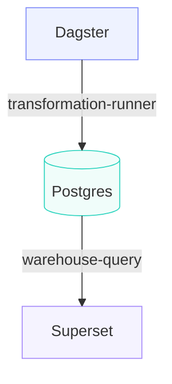
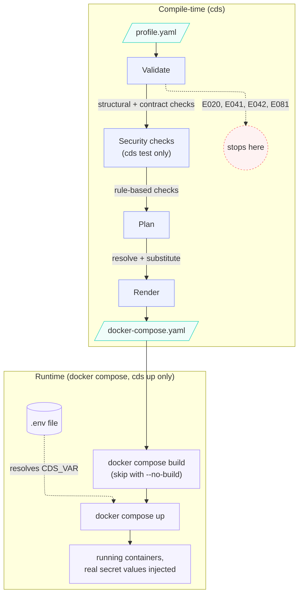

# 🚀 Composable Data Stack (CDS)

> **Terraform for data platforms.**
> Build, validate, secure, and evolve data stacks using modular components and explicit contracts.


---

## 🧠 What Is CDS (In 1 Minute)

Composable Data Stack (CDS) is a framework for defining and assembling data platforms from reusable modules such as orchestrators, warehouses, BI tools, and secrets providers.

## 🤝 Get Involved

- **Star and follow** on GitHub: [RonaldHensbergen/composable-data-stack](https://github.com/RonaldHensbergen/composable-data-stack)
- **Contribute**: open a discussion, file an issue, or send a PR to help shape CDS
- **Proof it**: if you run it in a real workflow, share your feedback — good or bad

> **Note:** Development helper tools are located in the `tools/` directory (git-ignored). See `tools/pr-cli/README.md` for PR creation scripts.

Instead of hardcoding integrations or relying on fragile pipelines, CDS introduces:

- 🔧 **Modules**: reusable components (Dagster, Postgres, Superset)
- 🔗 **Contracts**: explicit interfaces between components
- 🧩 **Profiles**: fully composed, runnable stacks

Think of it as Infrastructure as Code, but for data platforms.

---

## ⚡ Why CDS

Modern data platforms force a trade-off:

|Approach|Problem|
|---|---|
|Monolithic stack|Rigid, hard to evolve|
|Custom pipelines|Flexible but fragile and inconsistent|

CDS gives you the best of both:

- composability without chaos
- flexibility with guarantees
- modularity with structure
- no vendor lock-in by design

---

## 🎯 When To Use CDS

Use CDS if you:

- want to swap tools (Airflow ↔ Dagster, Superset ↔ Metabase)
- need reproducible environments across dev, CI, and prod
- are building a platform for multiple teams
- want contract-driven integration instead of implicit coupling

CDS may be overkill if:

- you only run a single-tool stack
- you do not need interchangeable components

---

## 🏗️ Example

The `local-dagster-postgres-superset` profile defines:

- Dagster -> orchestration
- Postgres -> storage
- Superset -> BI

### What CDS Does

1. Validates module definitions
2. Resolves contract bindings
3. Checks compatibility and security constraints
4. Produces a fully wired stack definition

`cds plan` resolves the full dependency graph before runtime configuration is generated, ensuring all module interactions are valid and predictable.

You can replace components without changing system behavior:

```text
Dagster -> Airflow
Superset -> Metabase
Postgres -> MariaDB
```

---

## 🗺️ Architecture Overview

CDS wires modules through **contracts**, not direct dependencies. This section has two levels: a high-level picture of what gets wired together ([Overview](#overview)), and a detailed look at what happens when you run a CDS command ([Internal Flow](#internal-flow)).

### Overview

Below, `local-dagster-postgres-superset` wires Dagster to Postgres to Superset through contracts:



### Internal Flow

CDS splits into two phases: **compile-time**, where `cds` itself validates, resolves, and renders a plain `docker-compose.yaml`; and **runtime**, where the real `docker compose` binary builds and starts containers from that file. CDS never runs containers itself.

`cds test` runs the full compile-time pipeline in order — **validate → security → plan → render** — stopping at the first stage that reports an error. `cds up` runs the same pipeline **minus security** (`validate → plan → render`), then hands off to `docker compose build`/`docker compose up`. See the [CLI table](#️-cli) below for exactly what each command runs.

- **Validate** checks profile shape, module configs, dependencies, secret refs, contract bindings, and outputs.
- **Security** (`cds test` only) runs rule-based checks against modules and resolved secrets.
- **Plan** resolves contract bindings and substitutes secrets and defaults.
- **Render** generates the final `docker-compose.yaml`, with secret values as `${CDS_VAR}` placeholders; never the raw value.
- **Runtime** (`cds up` only): `docker compose build` (skippable with `--no-build`), then `docker compose up`. Docker Compose, not CDS, resolves `${CDS_VAR}` placeholders from a `.env` file (see `cds init`) and starts the containers.



This mirrors the [`cds` command table](#️-cli) below: `validate`, `plan`, and `render` are each callable on their own; `security` only runs as part of `cds test`, not `cds up`. Module and contract definitions follow the [Contract-First](#contract-first) design principle, so most of what "Validate" and "Plan" check comes directly from `module.yaml` and `profile.yaml`.

**See also:** [Security](#-security) for what the security stage checks, [Troubleshooting](#️-troubleshooting) for what each error code means and how to fix it.

## 🔐 Security

CDS includes built-in security validation to prevent unsafe configurations before a stack is deployed.

The `cds security` checks analyze profiles and modules for common risks such as:

- weak or default passwords
- missing secret configurations
- insecure service exposure
- unsafe defaults in module configuration
- incomplete contract bindings that may leak data

Security checks run as part of validation and can be extended with custom rules.

### Example

```bash
cds security local-dagster-postgres-superset
```

---

## 📦 What You Get

When you run CDS:

- validated module graph
- resolved contract bindings
- dependency-aware execution plan
- generated Docker Compose configuration
- reproducible stack definition

This allows you to go from a declarative profile to a runnable local data stack.

---

## 🚀 Quickstart

### 1. Clone

```bash
git clone https://github.com/RonaldHensbergen/composable-data-stack.git
cd composable-data-stack
```

### 2. Setup Environment

Linux/macOS:

```bash
python3 -m venv .venv
source .venv/bin/activate
pip install -e .
```

Windows PowerShell:

```powershell
py -m venv .venv
.\.venv\Scripts\Activate.ps1
python -m pip install -e .
```

Windows CMD:

```bat
py -m venv .venv
.venv\Scripts\activate.bat
python -m pip install -e .
```

If PowerShell blocks the activation script, run
`Set-ExecutionPolicy -Scope Process -ExecutionPolicy Bypass` in the same
terminal session and activate the environment again.

### 3. Configure Environment

```bash
cds init local-dagster-postgres-superset
```

Set:

```text
CDS_ANALYTICS_POSTGRES_PASSWORD
CDS_DAGSTER_POSTGRES_PASSWORD
CDS_SUPERSET_POSTGRES_PASSWORD
CDS_SUPERSET_SECRET_KEY
CDS_SUPERSET_ADMIN_PASSWORD
```

### 4. Validate A Stack

```bash
cds validate local-dagster-postgres-superset
```

Expected output:

```text
Profile is valid.
```

### 5. Run Security Checks

```bash
cds security local-dagster-postgres-superset
```

### 6. Generate A Plan

```bash
cds plan local-dagster-postgres-superset
```

This resolves:

- module dependencies
- contract bindings
- execution order

### 7. Render The Stack

```bash
cds render local-dagster-postgres-superset
```

By default, this writes `docker-compose.yml` to the project root.

Use a custom location when needed:

```bash
cds render local-dagster-postgres-superset --output build/docker-compose.yml
```

This generates:

- docker-compose.yml
- service definitions
- fully wired module configuration

### 8. Run The Stack

```bash
cds up local-dagster-postgres-superset
```

This runs `validate` → `plan` → `render` → `docker compose build` → `docker compose up` in one step.
Add `--detach` (or `-d`) to run in the background:

```bash
cds up local-dagster-postgres-superset --detach
```

Use `--no-build` to skip the build step when images are already available:

```bash
cds up local-dagster-postgres-superset --no-build
```

### 9. Persistent Incoming Data Folder For Dagster

The Dagster module mounts a host directory into the containers so incoming files survive reboots.

- Host path: `workdirs/shared-data/incoming`
- Container path: `/app/data/cds/incoming`

Dagster includes a sensor that detects new files in `/app/data/cds/incoming` and runs a pickup job.
Picked files are moved to:

- Host path: `workdirs/shared-data/processed`
- Container path: `/app/data/cds/processed`

Create the directories once if they do not exist:

```bash
mkdir -p workdirs/shared-data/incoming workdirs/shared-data/processed
```

---

## 🧩 Core Concepts

### Modules

Reusable building blocks:

- orchestration (Dagster, Airflow)
- warehouse (Postgres, MariaDB)
- BI (Superset, Metabase)
- secrets (env, vault)

Structure:

```text
modules/<category>/<name>/
├── module.yaml
├── defaults.yaml
├── compose.yaml
├── scripts/
└── tests/
```

### Contracts

Contracts define how modules interact.

Examples:

|Contract|Purpose|
|---|---|
|sql-database|database interface|
|http-service|service exposure|
|secrets-provider|secret resolution|

Example binding:

```text
dagster.database -> postgres.sql-database
superset.database -> postgres.sql-database
```

No implicit dependencies. Everything is explicit.

### Profiles

Profiles define supported stacks:

```text
local-dagster-postgres-superset
local-airflow-postgres-superset
integration-airflow-postgres-dbt
```

Structure:

```text
profiles/[profile]/
├── profile.yaml
├── values.yaml
└── README.md
```

---

## ⚙️ CLI

|Command|Description|
|---|---|
|cds validate [profile]|Validate modules and contracts|
|cds plan [profile]|Resolve dependencies and generate an execution plan|
|cds render [profile]|Generate Docker Compose configuration from a resolved plan|
|cds up [profile]|Validate, plan, render, build, and start services with docker compose (use `--no-build` to skip build)|
|cds test [profile]|One-shot smoke validation: validate, security, plan, and render|

`[profile]` accepts:

| Form | Example |
| ---- | ------- |
| Profile name | `local-dagster-postgres-superset` |
| Path to a `profile.yaml` file | `profiles/local-dagster-postgres-superset/profile.yaml` |
| Path to a profiles root directory | `profiles/` |

When `[profile]` is omitted, `CDS_PROFILE_PATH` is used instead and accepts the same three forms. If neither is provided and exactly one profile exists under `profiles/`, it is selected automatically.

To view the full list of options for any command, use the `--help` flag:

```bash
cds --help
cds validate --help
cds plan --help
```

---

## 🪟 Windows Task Runner

Windows contributors without `make` can use `Makefile.ps1`, a PowerShell equivalent covering the core developer tasks:

```powershell
# Install in editable mode
.\Makefile.ps1 install

# Validate the default profile
.\Makefile.ps1 validate

# Validate a specific profile
.\Makefile.ps1 validate-profile -P profiles/local-dagster-postgres-superset/profile.yaml

# Build distribution packages
.\Makefile.ps1 package

# List available targets
.\Makefile.ps1 help
```

This does not replace the Linux/macOS `Makefile`, both exist side by side. Windows users can still install `make` via WSL or Chocolatey if they prefer the original workflow. `lint` and `docker-build` are not ported here. Run `yamllint .` and `npx markdownlint-cli` directly, or use `pre-commit` if it is set up in this repo. Docker Desktop's `docker build` works the same on Windows as it does elsewhere.

---

## 🛠️ Troubleshooting

Common errors from `cds validate`, `cds plan`, and `cds render`, and how to fix them.

| Error | Cause | Fix |
| --- | --- | --- |
| `[E020] ... YAML file not found: <path>` | The profile identifier or file path passed to `cds validate`, `cds plan`, or `cds render <profile>` doesn't resolve to an existing YAML file. | Run `cds list profiles` to see valid identifiers. Set `CDS_PROFILE_PATH` to a profile name, a `profile.yaml` file path, or a profiles root directory. |
| `[E081] ... Required secret "CDS_X_PASSWORD" not found in environment` | A secret marked `required: true` in the profile's `spec.secrets.values` is missing from the shell environment or the `.env` file in the current working directory. | Run `cds init <profile>` to generate `.env` in the project root, set the missing `CDS_*` variable, or export it directly before running the command. |
| `[E041] ... Contract ref "x.y" points to unknown module "x"` | A `consumes` binding's `contractRef` refers to a module ID that isn't defined in the profile. | Check `spec.modules` for the correct module `id`, and confirm the contract ref follows `<module-id>.<contract-name>`. |
| `[E041] ... but it does not provide "<contract-name>"` | The referenced module exists, but its `spec.provides` list doesn't expose that contract name. | Check the producing module's `module.yaml` for the contracts it actually provides, and fix the consumer's `contractRef` to match. |
| `[E042] ... Contract kind mismatch` | The consumer expects one contract kind (e.g. `sql-database`) but the producer exposes a different kind. | Point the binding at a module that provides the expected contract kind, or update the consumer's expected kind if the mismatch is intentional. |

All diagnostics print with their error code and YAML path (e.g. `spec.modules[1].config`), so search the profile file for that path to find the exact line to fix.

---

## 🔄 Workflow

```text
1. cds validate -> check module definitions
2. cds security -> detect unsafe configurations
3. cds plan -> resolve dependencies and bindings
4. cds render -> generate Docker Compose stack
5. cds up -> start services
6. cds test -> one-shot validate + security + plan + render smoke check
```

---

## 📂 Repository Structure

```text
.
├── cli/
├── modules/
│   ├── bi/
│   ├── orchestration/
│   ├── secrets/
│   └── warehouse/
├── profiles/
├── docs/
├── pyproject.toml
└── Makefile
```

---

## 🧱 Design Principles

### Contract-First

Modules declare:

- what they provide
- what they require
- configuration inputs
- health checks
- lifecycle hooks

### Profile-Driven

Profiles define supported stacks.
The profile is the unit of support, not individual modules.

### Zero Hidden Coupling

- no implicit environment variables
- no cross-module assumptions
- no shared mutable state

All interactions happen through explicit contracts.

### Security By Default

CDS validates configurations before runtime, ensuring that:

- weak credentials are detected early
- secrets are properly configured
- services are not unintentionally exposed

Security is part of platform composition, not an afterthought.

### One Model, Multiple Environments

The same composition model applies across:

- local development
- CI environments
- production

Only runtime packaging differs.

---

## 📊 Comparison

|Capability|Monolith|Custom pipelines|CDS|
|---|---|---|---|
|Swap components|❌|⚠️|✅|
|Reuse modules|❌|❌|✅|
|Explicit contracts|❌|❌|✅|
|Reproducibility|⚠️|⚠️|✅|
|Security validation|❌|❌|✅|
|Vendor lock-in|✅|⚠️|❌|

---

## 📌 Status

MVP ready:

- module validation
- contract resolution
- security checks
- profile composition
- Docker Compose rendering

Next:

- runtime orchestration
- Kubernetes support
- advanced secret providers
- stack bootstrap and health checks

See [docs/roadmap.md](docs/roadmap.md) for milestones and detailed status.
See [docs/support-policy.md](docs/support-policy.md) for OS support policy and platform-specific limitations.

---

## 🤝 Contributing

Contributions are welcome.

Please read these first:

- [CONTRIBUTING.md](CONTRIBUTING.md)
- [docs/maintainer-merge-policy.md](docs/maintainer-merge-policy.md)
- [CODE_OF_CONDUCT.md](CODE_OF_CONDUCT.md)
- [SECURITY.md](SECURITY.md)
- [SUPPORT.md](SUPPORT.md)
- [CHANGELOG.md](CHANGELOG.md)
- [RELEASE.md](RELEASE.md)

Good first contributions:

- adding new modules
- improving profile examples
- extending contract definitions
- adding validation or security rules

---

## 📖 Documentation

- [Quickstart](README.md#-quickstart) — get running in 5 minutes
- [From Docker Compose to CDS Profile](docs/from-docker-to-cds-profile.md) — complete transformation guide
- [Architecture](docs/architecture.md) — design and core concepts
- [Modules](docs/modules.md) — how to structure reusable components
- [Roadmap](docs/roadmap.md) — planned features and milestones

---

## 📜 License

See `LICENSE`.
