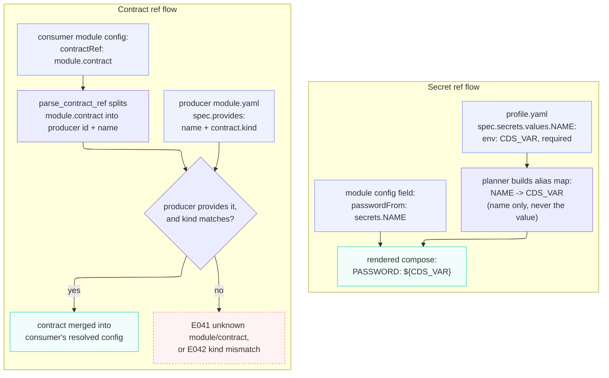

## Architecture

This repository is intended to evolve into a **production-ready, self-hosted data platform distribution** for CloudStack-based environments. The long-term goal is not only to provide modular local development stacks, but also to offer a deployable platform foundation that can reduce or replace a large portion of bespoke platform engineering effort.

The architecture is therefore designed around two parallel needs:

- **modularity**, so components can be swapped or upgraded over time
- **operational rigor**, so the resulting platform can mature toward production use

## Core model

The platform is organized around:

- **modules**: reusable platform components
- **profiles**: runnable combinations of modules for specific deployment targets
- **shared tooling**: common scripts, templates, validation, and conventions
- **examples**: sample workloads used for testing and demonstration

This structure allows the platform to support different combinations of orchestration, storage, transformation, validation, and BI technologies without rewriting the entire repository.

## Intended outcomes

The platform is being designed to support the following outcomes over time:

- local development and experimentation
- reproducible integration environments
- opinionated deployment profiles
- production-oriented stack distributions
- deployment into CloudStack-backed infrastructure
- a reduction in one-off platform glue and custom operational work

In other words, this repository is not just a demo stack. It is intended to become a maintainable platform foundation.

## Architectural layers

The platform is divided into logical layers.

| Layer | Responsibility | Example modules |
| --- | --- | --- |
| **Secrets** | credentials, secret injection, key management | Vault |
| **Infrastructure services** | service coordination backends and support systems | KeyDB, nginx |
| **Storage / compute** | databases, warehouses, and processing engines | Postgres, MariaDB, Spark |
| **Orchestration** | workflow scheduling and task execution | Airflow, Dagster |
| **Transformation** | data modeling and transformation | dbt |
| **Quality** | data validation and testing | Great Expectations, Soda |
| **BI / access** | dashboards, semantic access, and exploration | Superset, Metabase |
| **Platform tooling** | bootstrap, diagnostics, deployment helpers | shared scripts, templates |

Not every profile will contain every layer, but this layered model makes module responsibilities explicit and supports future production hardening.

## Modules

A module represents one implementation of a platform capability.

Examples:

- `modules/orchestration/airflow`
- `modules/orchestration/dagster`
- `modules/warehouse/postgres`
- `modules/warehouse/mariadb`
- `modules/warehouse/spark`
- `modules/transform/dbt`
- `modules/quality/great-expectations`
- `modules/bi/superset`
- `modules/secrets/vault`

Each module owns:

- its service definitions
- its configuration
- its runtime assumptions
- its module-specific documentation

This makes it possible to evolve the platform one capability at a time.

## Profiles

A profile is a supported platform composition.

Profiles define:

- which modules are included
- how modules are connected
- environment conventions
- networking and storage assumptions
- startup and deployment flow
- the intended use case

Examples of future profile types:

- **local development**
- **single-node integration**
- **production baseline**
- **CloudStack deployment**
- **high-availability variants**

A profile is the unit that should eventually become installable, testable, and supportable.

## Secrets and contract resolution

Two mechanisms are core to how CDS wires a stack together without leaking credentials or coupling modules directly: **secret refs** and **contract refs**. Both resolve through the same `validate → plan → render` pipeline (see the [README Internal Flow diagram](../README.md#internal-flow)).

**End-to-end example** (from `profiles/local-dagster-postgres-superset/profile.yaml`):

- **Secret**: `postgres` sets `passwordFrom: secrets.analytics_db_password`; the profile maps that alias to `env: CDS_ANALYTICS_DB_PASSWORD`. `load_profile_secrets` builds the alias→env-name map (name only, never the value); `resolve_expr` turns the ref into `${CDS_ANALYTICS_DB_PASSWORD}` in the rendered compose. Docker Compose resolves the real value at container start, CDS never touches it.
- **Contract**: `postgres` provides `sql-database`; `dagster` sets `analyticsDatabase.contractRef: postgres.sql-database`. `parse_contract_ref` splits producer + name. **Validate**: `validate_contract_bindings` checks producer exists, provides it, and kind matches; `E041` / `E042` on failure. **Plan**: `resolve_consumed_contracts` re-checks existence only (a kind mismatch would already have stopped at validate) and merges the resolved contract (host, port, `password: ${CDS_ANALYTICS_DB_PASSWORD}`, etc.) into `dagster`'s config. See [Troubleshooting](../README.md#️-troubleshooting) for `E041`/`E042`.

**Raw secret values are never embedded in rendered output.** Every `secrets.*` resolution path (`planner.py`'s `resolve_expr`, `renderer.py`'s `_resolve_expr`) emits a `${CDS_VAR_NAME}` placeholder, never the value; the `secrets` dict only ever holds alias→env-name mappings. Docker Compose reads the real value at container start, outside of CDS.

## CloudStack orientation

Because the target environment is CloudStack, the architecture should avoid assumptions that only fit managed cloud services. Instead, it should favor:

- self-hosted components
- explicit networking and storage configuration
- container-first deployment patterns
- infrastructure that can run on VMs or Kubernetes
- clear bootstrap and operational procedures
- replaceable dependencies

This makes the platform more suitable for private-cloud or infrastructure-managed environments where more operational responsibility remains within the platform itself.

## Design principles

### 1. Production path from the beginning

Even when a module starts as a local development component, it should be designed with a path toward production deployment in mind.

### 2. Clear boundaries

Each module should have one primary responsibility and avoid hidden coupling to unrelated components.

### 3. Replaceability

Platform capabilities should not be tied to one implementation forever.

Examples:

- Postgres may later be replaced or complemented by MariaDB or Spark-based storage
- Airflow may be replaced by Dagster for some profiles
- Great Expectations may be replaced by another validation framework

### 4. Profile-driven support

Supported stack combinations should be explicit. The repository should avoid an uncontrolled mix-and-match model and instead define supported profiles with known compatibility.

### 5. Operational transparency

All runtime assumptions should be documented:

- networks
- secrets
- storage
- ports
- bootstrap steps
- health checks
- backup expectations
- upgrade paths

### 6. Infrastructure portability

The platform should be runnable across:

- local development environments
- single-node servers
- multi-VM CloudStack environments
- container orchestration layers where appropriate

## Expected evolution

The platform will likely mature in stages.

### Stage 1: local modular development
- module boundaries defined
- one or more profiles runnable locally
- example workloads validate behavior

### Stage 2: reproducible integration stacks
- deterministic startup
- documented bootstrap
- basic health checks and validation
- simplified operator workflows

### Stage 3: production baseline
- hardened secrets handling
- backup and restore procedures
- monitoring and logging standards
- upgrade procedures
- failure recovery expectations
- documented security posture

### Stage 4: CloudStack distribution
- deployment patterns aligned to CloudStack
- VM/container layout guidance
- environment-specific profiles
- operational runbooks
- supportable release model

## Responsibility boundaries

### Modules own

- implementation-specific service definitions
- module-specific configuration
- module documentation
- module-local scripts
- implementation details

### Profiles own

- supported combinations of modules
- deployment target assumptions
- shared environment conventions
- topology and runtime wiring
- operator-facing setup and operations documentation

### Shared tooling owns

- bootstrap helpers
- diagnostics
- validation tooling
- common templates
- cross-profile conventions

## What “production-ready” means here

For this project, production readiness should eventually include:

- documented supported profiles
- deterministic installation and upgrade paths
- secrets handling that does not rely on committed credentials
- backup and restore support
- health checks and service readiness guarantees
- logging and monitoring integration points
- security hardening guidance
- version compatibility documentation
- operator documentation and runbooks

## Summary

This repository is intended to become more than a modular demo stack. It is being structured as the foundation for a **production-ready, self-hosted data platform distribution** suitable for **CloudStack environments**.

To support that goal, the architecture separates:

- **modules** for replaceable implementations
- **profiles** for supported platform distributions
- **shared tooling** for consistent operations
- **examples** for validation and testing

This structure allows the platform to grow from local development into a production-capable distribution without locking the project into one fixed stack too early.
